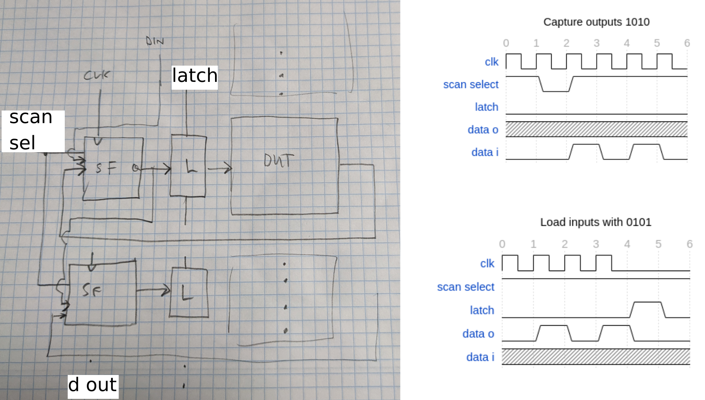
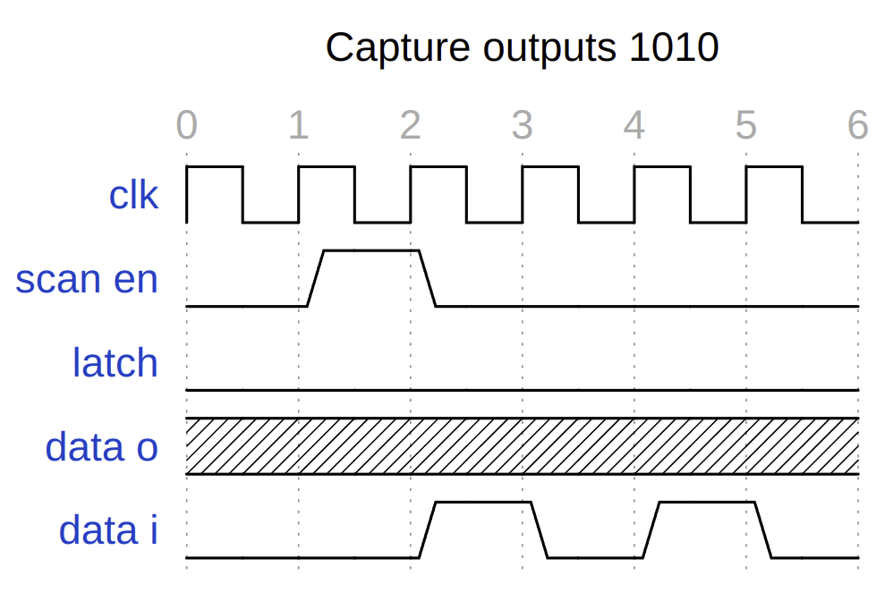
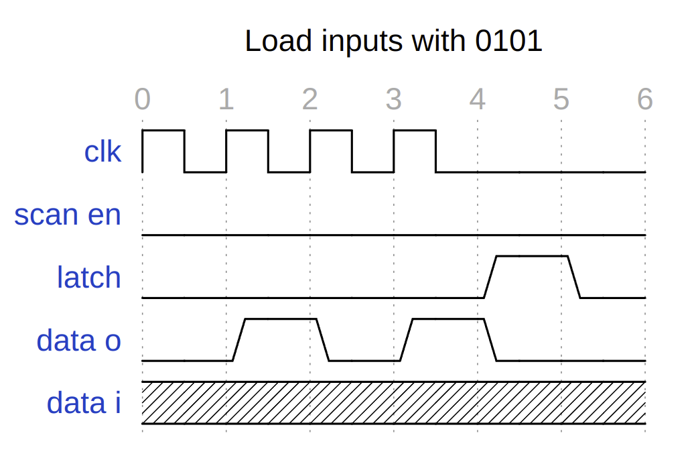
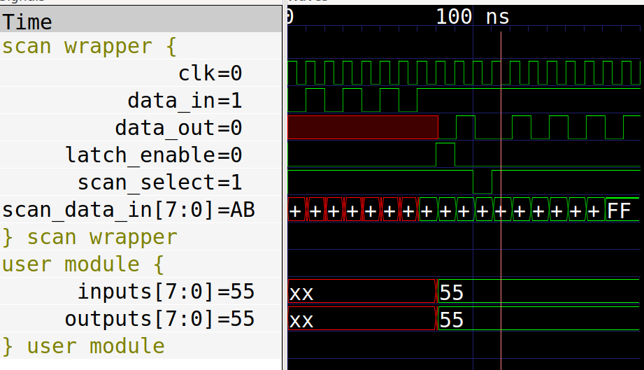

# scan wrapper

Proof of concept for a scan chain. 

The idea is that there will be 100's of modules with 8 ins and 8 outs.
They are all digital, and operate at slow speeds. 

Rather than try to multiplex all IO, or use tristate buffers, we use scan chain flipflops and latches to first latch in data, and then capture the output.

[read wavedrom diagram](https://wavedrom.com/editor.html?%7Bsignal%3A%20%5B%0A%20%20%7Bname%3A%20%27clk%27%2C%20wave%3A%20%27p.....%27%7D%2C%0A%20%20%7Bname%3A%20%27scan%20en%27%2C%20wave%3A%20%27010...%27%7D%2C%0A%20%20%7Bname%3A%20%27latch%27%2C%20wave%3A%20%270.....%27%7D%2C%0A%20%20%7Bname%3A%20%27data%20o%27%2C%20wave%3A%20%27x.....%27%7D%2C%0A%20%20%7Bname%3A%20%27data%20i%27%2C%20wave%3A%20%270.1010%27%7D%2C%0A%5D%2C%0Ahead%3A%7B%0A%20%20%20text%3A%27Capture%20outputs%201010%27%2C%0A%20%20%20tick%3A0%2C%0A%20%20%20every%3A1%0A%20%7D%7D%0A)

[load wavedrom diagram](https://wavedrom.com/editor.html?%7Bsignal%3A%20%5B%0A%20%20%7Bname%3A%20%27clk%27%2C%20wave%3A%20%27p...l.%27%7D%2C%0A%20%20%7Bname%3A%20%27scan%20en%27%2C%20wave%3A%20%270.....%27%7D%2C%0A%20%20%7Bname%3A%20%27latch%27%2C%20wave%3A%20%270...10%27%7D%2C%0A%20%20%7Bname%3A%20%27data%20o%27%2C%20wave%3A%20%2701010.%27%7D%2C%0A%20%20%7Bname%3A%20%27data%20i%27%2C%20wave%3A%20%27x.....%27%7D%2C%0A%0A%5D%2C%0Ahead%3A%7B%0A%20%20%20text%3A%27Load%20inputs%20with%200101%27%2C%0A%20%20%20tick%3A0%2C%0A%20%20%20every%3A1%0A%20%7D%7D%0A)

This trace shows loading 8 ins, then capturing 8 outs.

# logs

# Mon  4 Jul 15:34:28 CEST 2022

* fix scan select to match the pics

# Thu 30 Jun 15:34:41 CEST 2022

* scan controller is working with the tests, hardens to 230 x 100 which fits nicely in the corner taking 2 tiles
* things to decide:
    * single step
    * how to control clock freq
    * clock as separate port?
    * reset?

# Wed 29 Jun 13:00:45 CEST 2022

* 25x20 100x100u designs working DRC & LVS clean: 0c387847a1fe9829cdce3d334447f078c92dd8a9
* moved whole grid by -135 in both directions. PDN takes longer but still succeeds
* shifted down and try 18x18
* 10 x 10 routes OK with caravel! 032eae520e9bd8f6d3d4e9f4d21223f558cc1441
* fixed a bug with connecting inputs of first macro
* increasing the size of the design as PDN hangs when too small
* go to 100 x 100 with a 90um PDN pitch

# 28 Jun

* managed to get 10 x 10 square, with mpw5 tools, 
* converted to chain of all ins and outs

# before 25 Jun

Wrapped in scan_wrapper, put a bunch of designs inside a bigger one and used tristate tools like normal.

How to test this on ASIC? 

* with multi tools everything expects tristate
* these will need to be instantiated by hand

